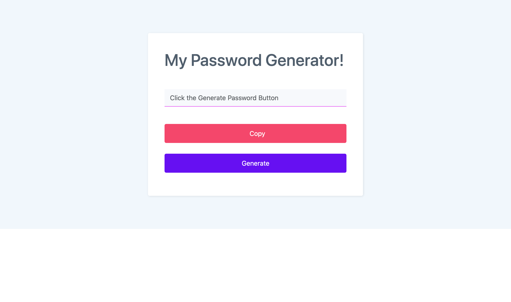

# Week 05 Challenge: Intermediate JavaScript — Password Generator

An app that runs in the browser and features dynamically updated HTML and CSS, all powered by JavaScript code that I wrote. It will have a clean and polished user interface that is responsive, ensuring that it adapts to multiple screen sizes.

The password can include special characters.

## Description

This project takes on the 5th week challenge which is creating a password generator app that runs on a web browser.

### Essential information

## Links/Submission

* REPO: https://github.com/i-k-dev/pw-gen
* PAGE: https://i-k-dev.github.io/pw-gen/

## Acceptance Criteria

Critical requirements necessary to develop this password generator app that satisfies the grades:

* Generate a password when the button is clicked. 🧐/⛔️
* Presents a series of prompts for password generation criteria;
* Length of password (at least 10 characters but no more than 64). ✅
* An alert that reminds you of a minimum of 10 characters (if selected less than 10). ✅
* Character types;
* Lowercase ✅
* Uppercase ✅
* Numeric ✅
* Special characters ($@%&*, etc.) ✅
* Code should validate for each input and at least one character type should be selected. 🧐/⛔️
* Once all prompts are answered, the password should be generated and displayed in an alert or written to the page. 🧐/⛔️

* A dynamically updated HTML and CSS web page. ✅
* Clean and polished user interface that is responsive. 🧐/✅

* Using Bootstrap. ✅

## Screenshots

Preview of whole site:

## Author

Contributor names and contact info

Ishqha Khidzr  
@ this-github-user :-)

## Thanks